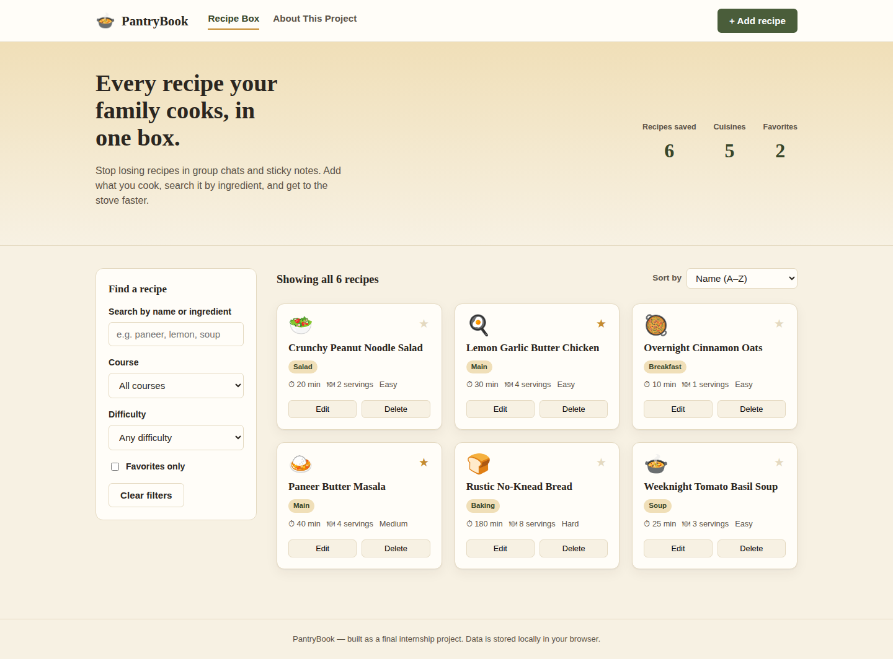
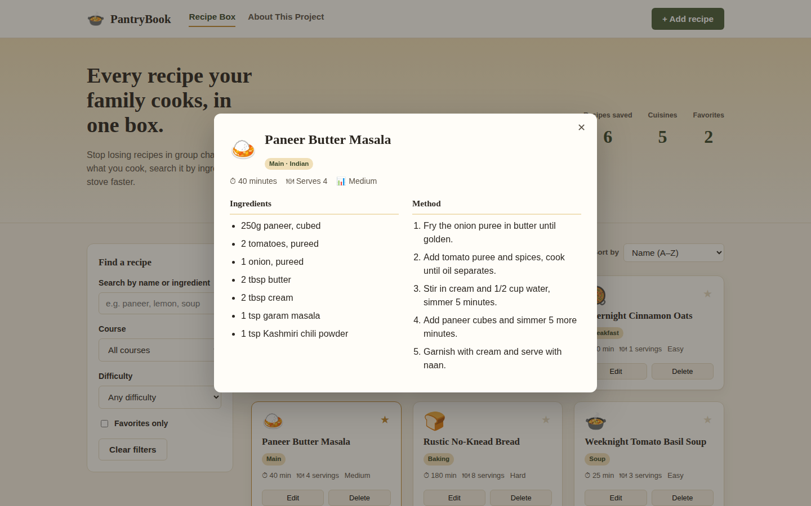
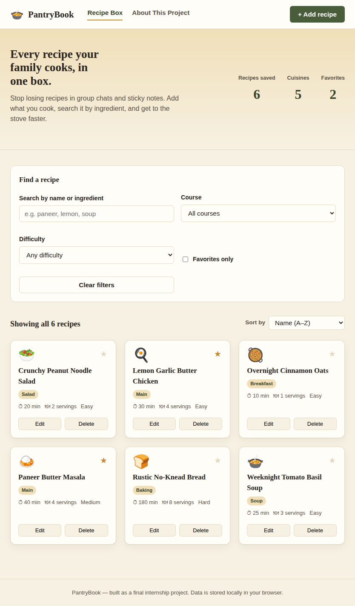
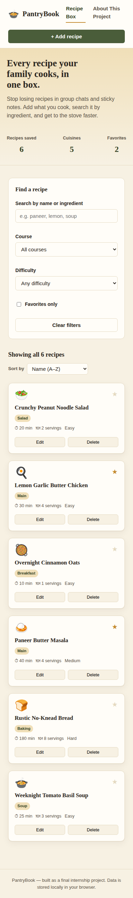

# 🍲 PantryBook — Personal Recipe Manager

A responsive web app for organizing, searching and cooking from your own recipe collection. Built as a final internship project to demonstrate HTML, CSS and JavaScript skills end to end.

**Live site:** https://rupeshharode.github.io/Pantry/
**Repository:** https://github.com/rupeshharode/Pantry.git

---

## Screenshots

| Desktop | Recipe detail |
|---|---|
|  |  |

| Tablet | Mobile |
|---|---|
|  |  |

---

## Features

- **Browse & search** — live search across recipe names and ingredients.
- **Filter & sort** — by course, difficulty, and favorites; sort by name, cook time, or difficulty.
- **Add / Edit / Delete** — full CRUD on recipes through a validated form.
- **Form validation** — required fields, minimum ingredient/step counts, numeric range checks, inline error messages.
- **Favorites** — one-click star toggle, reflected in the live stats bar.
- **Persistent storage** — recipes are saved to `localStorage` so data survives a page refresh.
- **Fully responsive** — CSS Grid + Flexbox layout that reflows for desktop, tablet and mobile.

## Folder structure

```
pantrybook/
├── index.html            # Main recipe box page
├── about.html             # Project documentation page
├── css/
│   └── style.css          # Box model, Flexbox, Grid, media queries
├── js/
│   └── script.js          # Data, DOM rendering, events, validation, storage
├── images/
│   └── favicon.svg        # App icon
├── screenshots/           # Screenshots used in this README / report
├── .gitignore
└── README.md
```

## Tech stack

HTML5 · CSS3 (Flexbox, Grid, custom properties, media queries) · vanilla JavaScript (ES6). No frameworks, no build step — clone and open `index.html`.

## Run it locally

```bash
git clone <your-repo-url>
cd pantrybook
# open index.html directly


---

## Git & version control workflow (Task 1)

This project was built with a real, incremental Git history — not a single dump commit. Commands used throughout:

```bash
git init -b main                 # initialize the repository
git status                       # check staged/unstaged changes at every step
git add <files>                  # stage specific files per logical change
git commit -m "message"          # commit with a meaningful message
git log --oneline                # review commit history
git remote add origin <repo-url> # link to GitHub (run once, see Task 2 below)
git push -u origin main          # push local history to GitHub
```

### Enable GitHub Pages

1. On GitHub, open the repository → **Settings → Pages**.
2. Under **Build and deployment**, set **Source** to `Deploy from a branch`.
3. Choose branch `main`, folder `/ (root)`, then **Save**.
4. Your live URL will be `https://<your-username>.github.io/pantrybook/` within a minute or two.
5. Confirm both `index.html` and `about.html` load, and that search/filter/add/edit/delete all work on the live URL.

